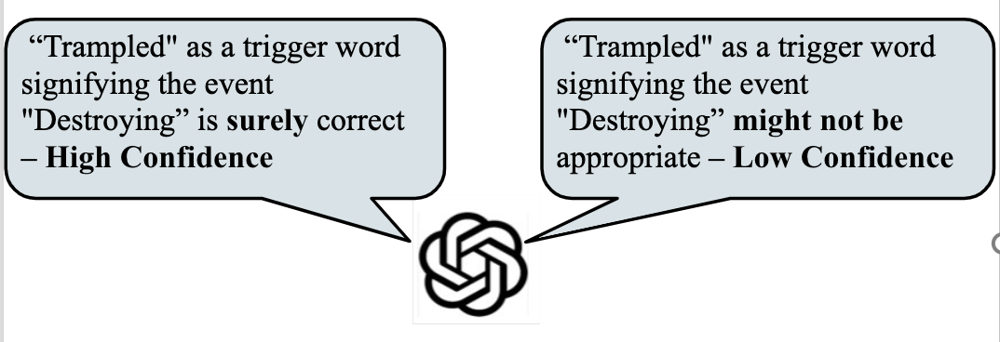
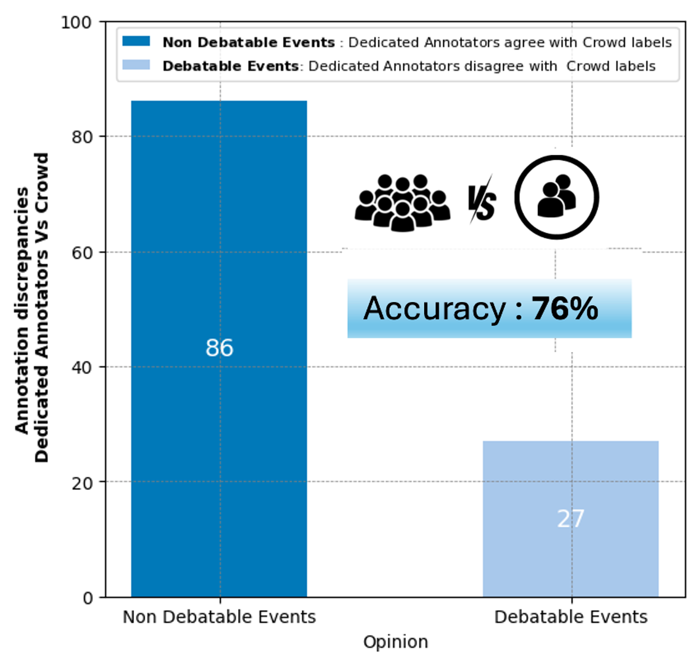
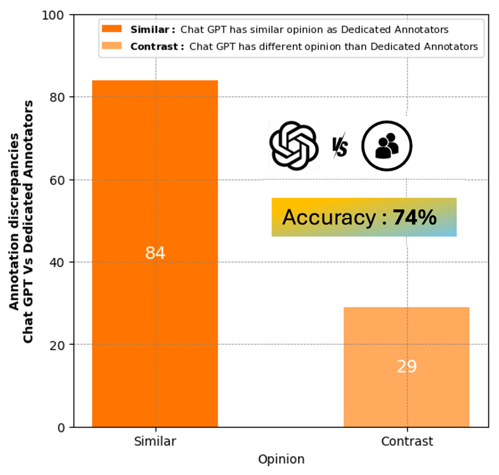

# 🎓 Master's Thesis: Leveraging Linguistic Insights for Uncertainty Calibration of LLM and Evaluating Crowdsourced Annotations 🚀

Welcome to the repository for my master's thesis project! This research explores the potential of using a popular large language model, ChatGPT-4, to enhance the quality of crowdsourced data labels, particularly within the MAVEN dataset.

## 📝 Abstract
Assessing and enhancing the quality of crowdsourced annotations is essential for developing reliable AI systems as noise and biases in the data can propagate, undermining the accuracy and fairness of downstream classification and other AI-driven processes. However, relying solely on human evaluators for this task has its own challenges. As the size of datasets increases, the cost and time required for manually scrutinize the crowd annotations also rises. To address this challenge, this paper explores leveraging large language models (LLMs) to evaluate crowdsourced labels. Specifically, we investigated using the certainty expressed in LLM responses as a metric to determine the trustworthiness of LLM evaluations.
We introduce a novel method that uses linguistic cues as indicators of LLM's certainty levels. By applying this method with ChatGPT-4 to evaluate a general domain event annotation dataset, we found that ChatGPT-4 successfully identified 58\% of the incorrect labels recognised by the human evaluators. However, a closer inspection on the discrepancies between the LLM and human evaluations revealed additional incorrect labels missed or misidentified by the human evaluators. These findings challenge the exclusive reliance on human experts for generating ground truth labels and highlight the potential for improving data label quality through human-AI collaboration. We draw design implications for future annotation evaluation paradigms with LLMs in the loop, and discuss the ethical consideration of using LLM as an evaluation tool for crowdsourced annotations.

## 🎯 Conclusion
Our findings reveal that ChatGPT-4 successfully identified 58% of the incorrect labels, demonstrating the promising role of LLMs in evaluating crowdsourced data annotations. This approach can enhance the accuracy and fairness of annotations while saving time and costs.

## 📊 Visualizations
Here are some visualizations from the study:

  <!-- Smaller Image -->
  

<!-- Larger Images Side by Side -->

  
  

🔗 **[Explore more detailed visualizations, results and conclusion by reading the full paper on Purdue Hammer](https://hammer.purdue.edu/articles/thesis/Leveraging_Linguistic_Insights_for_Uncertainty_Calibration_of_ChatGPT_and_Evaluating_Crowdsourced_Annotations/26214551)**

## 📬 Get in Touch
Feel free to reach out if you have any questions or feedback! You can contact me via:

- Email: [divyareddy.pulipati@gmail.com](mailto:divyareddy.pulipati@gmail.com)
- LinkedIn: [LinkedIn/DivyaSree](https://www.linkedin.com/in/divya-sree-pv/)

## 🙌 Contributors
A special thanks to those who supported and guided me throughout this project:

- **Dr. Tianyi Li** - Advisor
- **Dr. Tatiana Ringenberg** - Committee Member
- **Dr Julia Rayz** - Committee Member

---

Thank you for visiting my project repository! If you found this work interesting, please consider leaving a star ⭐ to show your support.
